# OpenCode-Base 模块依赖关系

> 基于 pom.xml 实际声明的模块间依赖，共 43 个模块

## 层级规则

- 只能依赖同层或更低层：3xx → 2xx → 1xx → 0xx
- **必需依赖**：组件正常运行必须（实线箭头 `-->`）
- **可选依赖**：增强功能，`<optional>true</optional>`（虚线箭头 `-.->`)

---

## 第0层：核心层 (001)

| 组件 | 必需依赖 | 可选依赖 | 说明 |
|------|---------|---------|------|
| 001-Core | 无 | 无 | 零依赖，所有组件的基础 |

---

## 第1层：基础层 (101-118)

| 组件 | 必需依赖 | 可选依赖 | 说明 |
|------|---------|---------|------|
| 101-Cache | Core | - | 本地缓存 |
| 102-ClassLoader | Core | - | 类加载与扫描 |
| 103-Collections | Core | - | 集合扩展 |
| 104-Crypto | Core | - | 密码学基础 |
| 105-Date | 无 | - | 日期时间处理，零依赖 |
| 106-DeepClone | Core | - | 深度克隆 |
| 107-Hash | Core | - | 哈希算法 |
| 108-I18n | Core | - | 国际化 |
| 109-ID | Core | - | ID生成器 |
| 110-IO | Core | - | IO工具 |
| 111-Reflect | Core | - | 反射工具 |
| 112-String | Core | - | 字符串处理 |
| 113-Expression | Core | Reflect | 表达式引擎，可选反射增强 |
| 117-Lock | Core | ID | 锁抽象，可选用ID生成Fencing Token |
| 118-Rules | Core | Expression | 规则引擎，可选表达式支持 |

---

## 第2层：领域层 (200-213)

| 组件 | 必需依赖 | 可选依赖 | 说明 |
|------|---------|---------|------|
| 200-Config | Core | String, Yml, Validation | 配置管理，可选表达式求值、验证 |
| 201-Functional | Core | - | 函数式增强 |
| 202-Json | Core | - | JSON处理(SPI) |
| 203-Log | Core | - | 日志门面 |
| 204-Net | Core | Json | HTTP客户端，可选JSON序列化 |
| 205-Parallel | Core | - | 并行计算(虚拟线程) |
| 206-Pool | Core | Observability | 对象池，可选指标采集 |
| 207-Resilience | Core | Observability | 弹性能力(重试/熔断/限流)，可选指标 |
| 208-Security | Core | - | 安全策略 |
| 209-Serialization | Core, Json | DeepClone | 序列化门面，必需Json，可选深拷贝 |
| 210-Validation | Core | Expression | 数据校验，可选表达式规则 |
| 211-Xml | Core | - | XML处理 |
| 212-Yml | Core | - | YAML处理(SPI) |
| 213-OAuth2 | Core | - | OAuth2客户端 |

---

## 第3层：业务层 (300-318)

| 组件 | 必需依赖 | 可选依赖 | 说明 |
|------|---------|---------|------|
| 300-Captcha | 无 | - | 验证码，零依赖 |
| 301-DB | 无 | - | 数据访问，零依赖 |
| 302-Email | Core | OAuth2 | 邮件发送，可选OAuth2认证 |
| 303-Event | Core | Serialization | 事件驱动，可选序列化 |
| 304-Feature | Core | Cache, Expression | 特性开关，可选缓存和条件表达式 |
| 305-Geo | Core | - | 地理信息 |
| 306-Graph | Core | - | 图算法 |
| 307-Image | Core | - | 图像处理 |
| 308-Lunar | Core | - | 农历 |
| 309-Money | Core | - | 金额处理 |
| 310-Observability | Core | - | 可观测性 |
| 311-SMS | Core | - | 短信发送 |
| 312-Tasker | Core | Observability | 任务调度，可选指标采集 |
| 313-Test | Core | - | 测试辅助 |
| 314-TimeSeries | Core | - | 时间序列 |
| 315-Tree | Core | - | 树形结构 |
| 316-Web | Core | - | Web工具 |
| 318-Pdf | Core | - | PDF处理 |

---

## 依赖统计

| 指标 | 数值 |
|------|------|
| 模块总数 | 43 |
| 零依赖模块 | 3 (Core, Date, Captcha, DB) |
| 仅依赖 Core | 27 |
| 有可选依赖 | 12 |
| 总依赖数 | 56 (必需 44 + 可选 12) |

---

## 依赖关系图 (Mermaid)

```mermaid
graph TB
    subgraph L0["核心层 0xx"]
        C001[001-Core]
    end

    subgraph L1["基础层 1xx"]
        C101[101-Cache]
        C102[102-ClassLoader]
        C103[103-Collections]
        C104[104-Crypto]
        C105[105-Date]
        C106[106-DeepClone]
        C107[107-Hash]
        C108[108-I18n]
        C109[109-ID]
        C110[110-IO]
        C111[111-Reflect]
        C112[112-String]
        C113[113-Expression]
        C117[117-Lock]
        C118[118-Rules]
    end

    subgraph L2["领域层 2xx"]
        C200[200-Config]
        C201[201-Functional]
        C202[202-Json]
        C203[203-Log]
        C204[204-Net]
        C205[205-Parallel]
        C206[206-Pool]
        C207[207-Resilience]
        C208[208-Security]
        C209[209-Serialization]
        C210[210-Validation]
        C211[211-Xml]
        C212[212-Yml]
        C213[213-OAuth2]
    end

    subgraph L3["业务层 3xx"]
        C300[300-Captcha]
        C301[301-DB]
        C302[302-Email]
        C303[303-Event]
        C304[304-Feature]
        C305[305-Geo]
        C306[306-Graph]
        C307[307-Image]
        C308[308-Lunar]
        C309[309-Money]
        C310[310-Observability]
        C311[311-SMS]
        C312[312-Tasker]
        C313[313-Test]
        C314[314-TimeSeries]
        C315[315-Tree]
        C316[316-Web]
        C318[318-Pdf]
    end

    %% Core -> All (必需)
    C001 --> L1
    C001 --> L2
    C001 --> L3

    %% 基础层可选依赖
    C113 -.-> C111
    C117 -.-> C109
    C118 -.-> C113

    %% 领域层依赖
    C200 -.-> C112
    C200 -.-> C212
    C200 -.-> C210
    C204 -.-> C202
    C206 -.-> C310
    C207 -.-> C310
    C209 --> C202
    C209 -.-> C106
    C210 -.-> C113

    %% 业务层依赖
    C302 -.-> C213
    C303 -.-> C209
    C304 -.-> C101
    C304 -.-> C113
    C312 -.-> C310

    classDef required fill:#4CAF50,stroke:#2E7D32,color:white
    classDef optional fill:#FFF9C4,stroke:#F9A825

    linkStyle default stroke:#999,stroke-width:1px
```

---

## 被复用最多的模块 (Top 5)

| 模块 | 被依赖次数 | 依赖方 |
|------|-----------|--------|
| 001-Core | 40 | 几乎所有模块 |
| 310-Observability | 3 | Pool, Resilience, Tasker |
| 113-Expression | 3 | Rules, Validation, Feature |
| 202-Json | 2 | Serialization(必需), Net(可选) |
| 101-Cache | 1 | Feature |

---

## 循环依赖检查

**结果: 无循环依赖**

所有依赖都是单向的，遵循层级规则：
- 3xx → 2xx → 1xx → 0xx
- 同层内无循环
- 可选依赖不会引入循环

---

## 完整依赖列表（按字母序）

| 模块 | 必需依赖 | 可选依赖 |
|------|---------|---------|
| cache | core | - |
| captcha | - | - |
| classloader | core | - |
| collections | core | - |
| config | core | string, yml, validation |
| core | - | - |
| crypto | core | - |
| date | - | - |
| db | - | - |
| deepclone | core | - |
| email | core | oauth2 |
| event | core | serialization |
| expression | core | reflect |
| feature | core | cache, expression |
| functional | core | - |
| geo | core | - |
| graph | core | - |
| hash | core | - |
| i18n | core | - |
| id | core | - |
| image | core | - |
| io | core | - |
| json | core | - |
| lock | core | id |
| log | core | - |
| lunar | core | - |
| money | core | - |
| net | core | json |
| oauth2 | core | - |
| observability | core | - |
| parallel | core | - |
| pdf | core | - |
| pool | core | observability |
| reflect | core | - |
| resilience | core | observability |
| rules | core | expression |
| security | core | - |
| serialization | core, json | deepclone |
| sms | core | - |
| string | core | - |
| tasker | core | observability |
| test | core | - |
| timeseries | core | - |
| tree | core | - |
| validation | core | expression |
| web | core | - |
| xml | core | - |
| yml | core | - |

---

## 设计特点

1. **扁平化依赖** - 绝大多数模块仅依赖 Core，保持最大独立性
2. **可选依赖最小化** - 只有 12 个可选依赖，避免耦合
3. **Serialization 是唯一有双必需依赖的模块** (Core + Json)
4. **Observability 作为横切关注点** - Pool、Resilience、Tasker 可选引入
5. **Expression 作为动态能力** - Rules、Validation、Feature 可选引入
6. **零依赖独立模块** - Date、Captcha、DB 可完全独立使用
